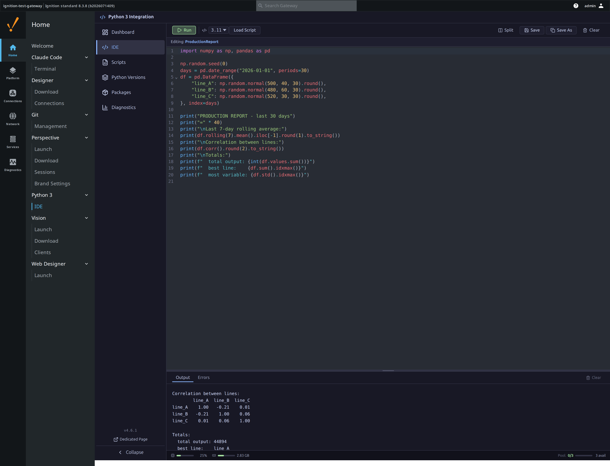
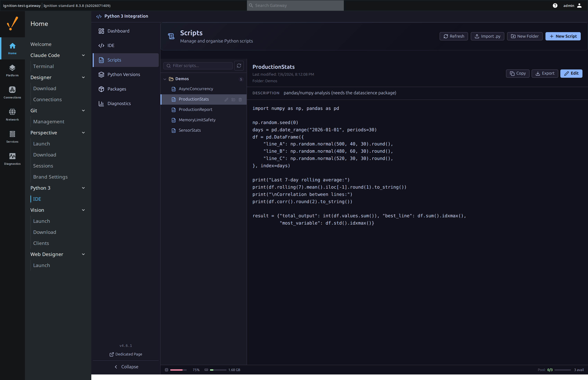
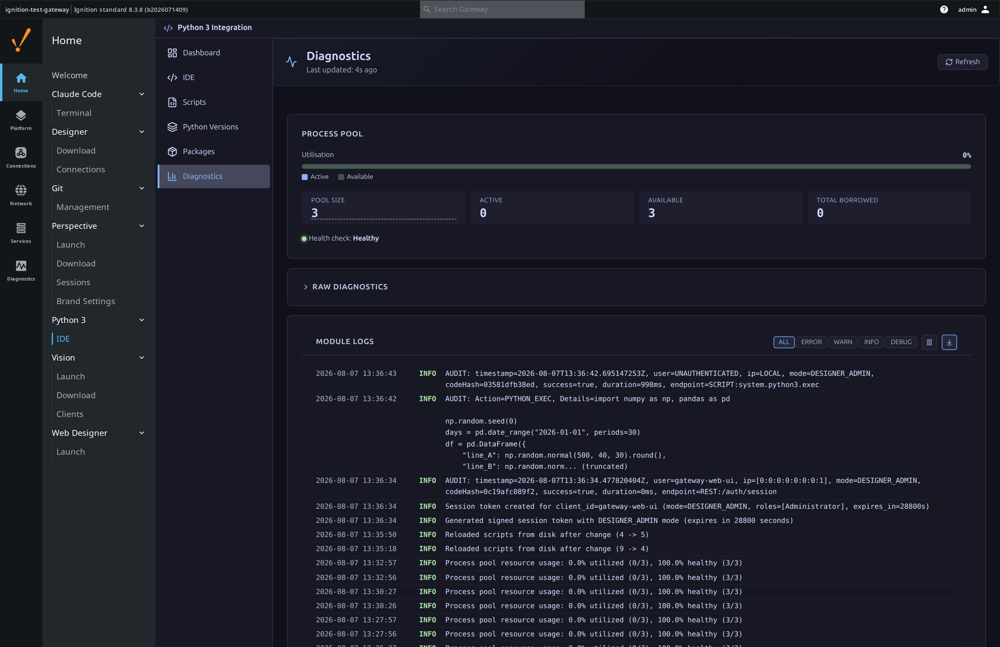
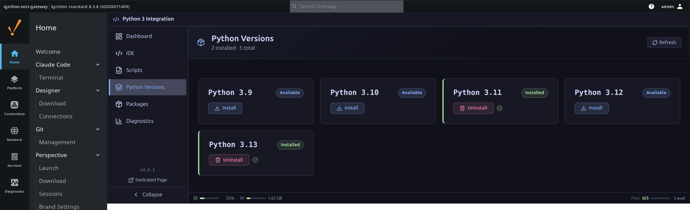
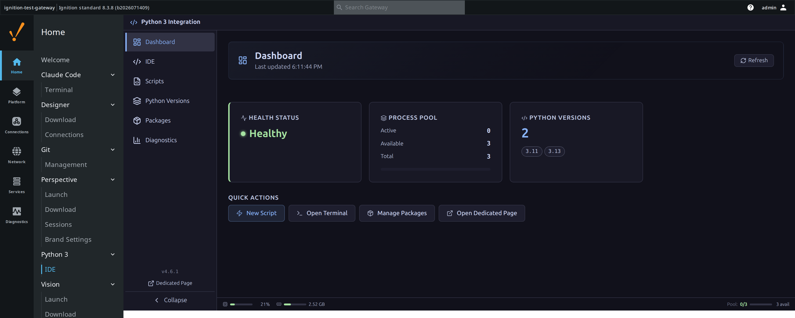
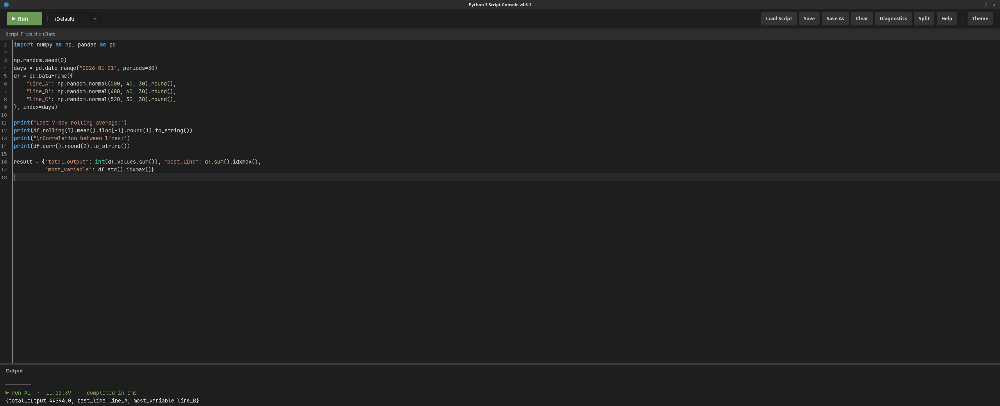
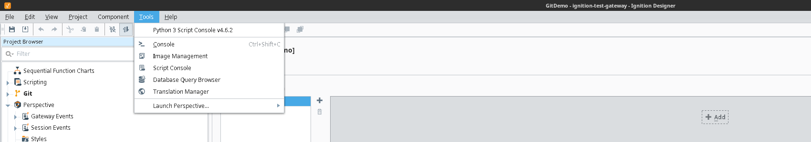
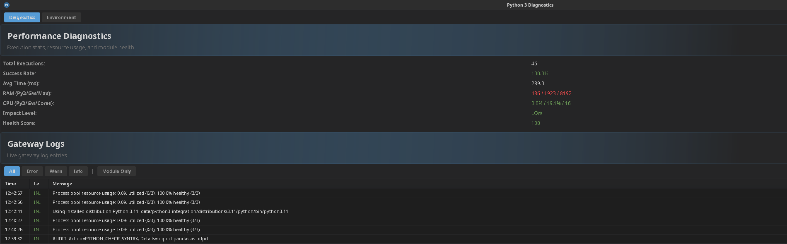

# Python 3 Integration for Ignition

Real Python 3 — `requests`, `pandas`, `numpy`, and the rest of PyPI — callable from any Ignition 8.3 gateway as if it were a native scripting library.


[](https://inductiveautomation.com/)
[](LICENSE)

**Repository:** `ignition-module-python3` | **Module ID:** `com.gaskony.python3`

---

## Why this exists

Ignition is built on Jython 2.7 and realistically always will be — but nearly
every programmer today works in Python 3, and the packages that matter
(`requests`, `pandas`, `numpy`, …) are Python 3 only. This module makes
Python 3 feel like a native part of any Ignition 8.3 gateway: write and test
a Python 3 script in a first-class editor, save it into a Project-Library-like
tree, and call it from anywhere Jython runs — Perspective pages, tag scripts,
gateway events — via `system.python3.*`.

The full purpose, definition of done, and permanent won't-do list live in
[docs/PROJECT_CHARTER.md](docs/PROJECT_CHARTER.md) — the charter drives every
release decision.

---

## What it looks like


*The browser-based IDE: real code, run against a real warm Python 3 process, with the script's own printed output shown inline. No Designer required.*


*Scripts are organised into folders and are real files on disk — select one to see its source, description and last-modified time.*


*Diagnostics: pool utilisation and the module's own log stream — including the per-call audit trail (mode, code hash, duration) — filterable by level.*


*Multiple Python versions can be installed side by side; scripts pick which one they run against.*


*The landing dashboard: module health, process pool and installed versions at a glance.*


*The Designer-scope Script Console: the `ProductionStats` demo script,
syntax-highlighted, run against the same warm process pool as the Web UI — the
run completed and returned its result dict, shown in the Output pane.*


*Python 3 Scripts is a first-class node in the Designer's Project Browser, not
a bolted-on window — it gets its own tree icons and its own right-click menu
alongside the built-in nodes like Perspective and Transaction Groups.*


*The module registers itself in the Designer's own Tools menu, versioned
alongside the rest of the built-in tools.*


*Autocomplete is powered by a Jedi engine running on the Gateway, not a static
keyword list — it resolves real members of whatever's actually imported,
with descriptions, in a proper editor popup (Ctrl+Space).*


*A read-only Diagnostics view reachable from the Designer: pool health and
performance stats plus a live tail of the Gateway's own log, filterable by
level — no need to leave the Designer to see what the module is doing.*

---

## What it does

| Feature | What it gives you |
| ------- | ------------------ |
| `system.python3.*` scripting functions | Call Python 3 from any Jython scope — Perspective bindings, tag events, gateway timers — via `exec`, `eval`, `callScript`, `callModule` |
| Gateway Web UI IDE | Browser-based editor with syntax highlighting, script folders, autocomplete and inline output — no Designer needed |
| Designer Script Console + Project Browser | A native Designer editor plus a "Python 3 Scripts" node in the project tree, for developers who live in the Designer |
| Process pool of warm subprocesses | 3–20 pre-warmed Python interpreters (configurable) so `exec` calls skip process-start cost; health-checked every 30 s and self-recovers from a crashed worker |
| Multiple installable Python versions | 3.9–3.13 installed side by side; each script picks which one it runs against |
| Package management | Search and install PyPI packages per Python version, from the gateway UI |
| REST API | `POST /exec`, `/eval`, `/call-module`; `GET /version`, `/pool-stats`, `/health`, `/diagnostics` — token-gated, HTTPS-required for admin mode |
| File-backed script library | Scripts are real `.py` files on disk (gateway-global, hot-reloaded on external edit), not an opaque blob |
| Live diagnostics | Pool utilisation, execution metrics and an auditable log of every call, in one view |

See [CHANGELOG.md](CHANGELOG.md) for the full release history.

---

## How to use it

```bash
./gradlew clean build --no-daemon
# Install build/Python3-4.6.2.modl via Gateway > Config > System > Modules
```

Then, from any Jython scope (Script Console, a tag event, a Perspective binding):

```python
result = system.python3.exec("import requests; result = requests.get('https://example.com').status_code")
print(result)  # 200
```

Or open the browser IDE at **Config → Python 3 → IDE** (`/app/python3-ide` on
the gateway) to write, run and save scripts without touching a project. See
[docs/getting-started/QUICK_START.md](docs/getting-started/QUICK_START.md)
and [docs/getting-started/INSTALLATION.md](docs/getting-started/INSTALLATION.md)
for the full walkthrough.

---

## Documentation

- **REST API**: [docs/api/REST_API.md](docs/api/REST_API.md)
- **Architecture**: [docs/architecture/OVERVIEW.md](docs/architecture/OVERVIEW.md)
- **Security model**: [SECURITY.md](SECURITY.md)
- **Changelog**: [CHANGELOG.md](CHANGELOG.md) — release history

## For developers

```bash
# Build module
./gradlew clean build --no-daemon

# Test with Docker
docker-compose up -d
# Access at http://localhost:9088
```

- **Version workflow**: [docs/development/VERSION_WORKFLOW.md](docs/development/VERSION_WORKFLOW.md)
- **Testing guide**: [docs/development/TESTING.md](docs/development/TESTING.md)

## External resources

- **Official SDK docs**: <https://www.sdk-docs.inductiveautomation.com/>
- **SDK examples**: <https://github.com/inductiveautomation/ignition-sdk-examples>
- **Forum**: <https://forum.inductiveautomation.com/c/module-development/7>
- **Gradle plugin**: <https://github.com/inductiveautomation/ignition-module-tools>

## Credits

Built using the Ignition 8.3 SDK from Inductive Automation.

## Licence

Apache License 2.0 — see [LICENSE](LICENSE).
