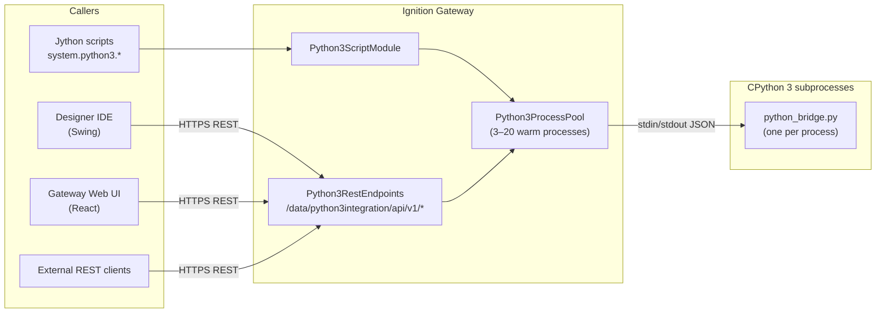
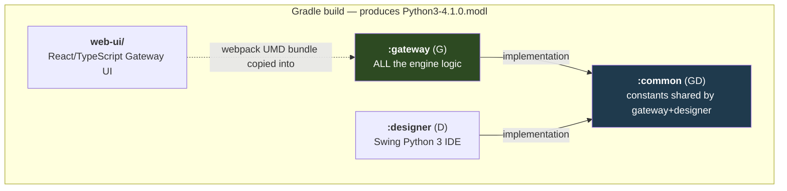
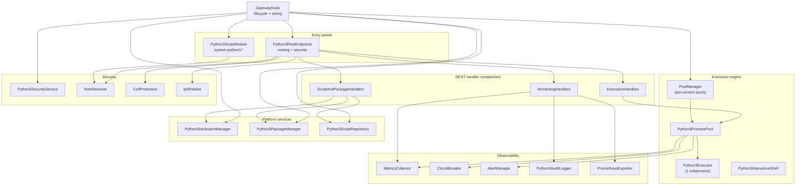
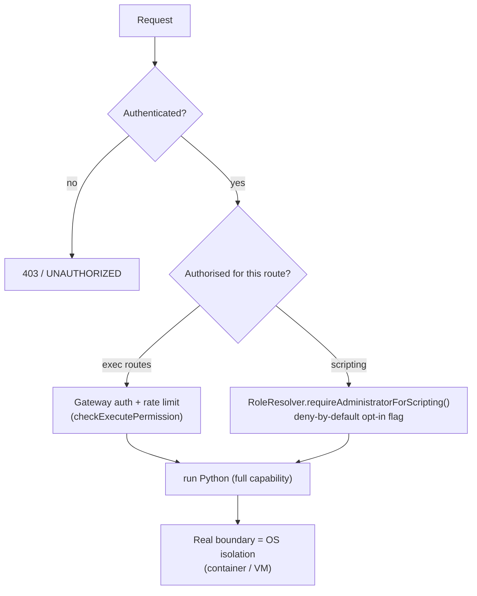
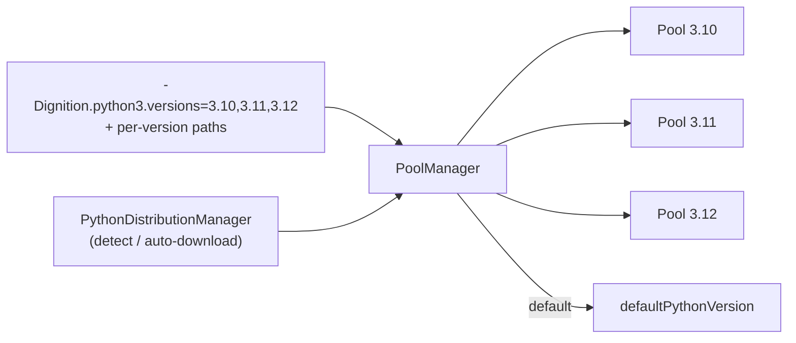

# Architecture

A visual, engineering-level guide to how the **Python 3 Integration** module is built, what it does,
and how the pieces fit together. Diagrams render automatically in VS Code (with a Mermaid extension)
and on GitHub. An interactive version of the component map lives next to this file in
[`architecture.html`](architecture.html).

> **Keep this current.** When you change a flow, update the matching diagram in the same commit.
> Each diagram is small and self-contained on purpose. A maintenance checklist is at the
> [end of this document](#keeping-this-document-up-to-date).


> Supersedes the older `OVERVIEW.md`, which still names the main IDE class `Python3IDE_v2` (now
> `Python3IDE`), references the old `com.inductiveautomation.*` package paths, and predates most of
> the designer's manager classes. See [§13](#13-review-findings--changes-v410) for the audit behind this rewrite.

---

## 1. What it does (in one picture)

Ignition's built-in scripting is **Jython 2.7**. This module lets you run **real CPython 3** from
Ignition — from Jython (`system.python3.*`), from a REST API, from a Designer IDE, and from a
Gateway web UI — by keeping a **pool of warm Python 3 subprocesses** and talking to them over a
line-based JSON protocol.



**The core idea:** every execution path funnels into one **process pool**. The pool hands out a
warm `Python3Executor` (one CPython subprocess), the executor ships the request as a single JSON
line to `python_bridge.py`, the bridge runs it and writes one JSON line back.

---

## 2. Physical makeup — three scopes + a React app

The module is a **Gradle multi-project build**. Three sub-projects compile to code that runs in
different Ignition scopes; a fourth directory (`web-ui/`) is a React app whose webpack bundle is
copied into the gateway jar at build time.



| Sub-project | Scope | Role |
|-------------|-------|------|
| **`gateway/`** | `G` | The whole engine: process pool, executor, the Python bridge, REST API, security, distribution/package management, monitoring. |
| **`common/`** | `GD` | Single-source-of-truth constants shared by gateway + designer: `ApiEndpoints` (route paths), `JsonFields`, `PoolConfig`, `Constants`, `Python3RpcFunctions`. |
| **`designer/`** | `D` | The Swing **Python 3 IDE / Script Console**. Talks to the gateway purely over REST — no RPC. |
| **`web-ui/`** | — | The React **Gateway Web UI** (IDE, Scripts, Packages, Versions, Diagnostics). Webpack emits a UMD bundle `Python3IDE.js`. |

**Build wiring worth knowing** (so a UI change actually ships): `gateway/build.gradle.kts` defines
`npmInstall` → `npm run build` (webpack) → `copyReactUIResources`, which copies
`web-ui/build/generated-resources/mounted/Python3IDE.js` into `gateway/.../resources/mounted/`. The
gateway serves that folder at `/res/python3integration/` (see `getMountedResourceFolder()` +
`getMountPathAlias()` in `GatewayHook`), and registers a Gateway nav page pointing at it.

```
ignition-module-python3/
├── build.gradle.kts          # root build (scopes G/D/GD, signing, OWASP)
├── settings.gradle.kts       # includes :common, :gateway, :designer
├── common/src/main/java/com/gaskony/python3/
│   ├── ApiEndpoints.java     # 40+ REST route path constants
│   ├── JsonFields.java       # 50+ JSON field-name constants
│   ├── PoolConfig.java       # pool sizes (1/3/20), timeouts
│   └── Python3RpcFunctions.java
├── gateway/src/main/
│   ├── java/com/gaskony/python3/gateway/   # ← the engine (see §3)
│   └── resources/
│       ├── python_bridge.py          # the Python side of the bridge
│       ├── packages.json             # bundled-wheel catalogue
│       ├── python-packages/          # offline wheels (linux-x64, windows-x64)
│       └── mounted/Python3IDE.js     # ← webpack output, copied in at build time
├── designer/src/main/java/.../designer/    # Swing IDE (see §11)
└── web-ui/src/                              # React Gateway UI (see §11)
```

---

## 3. Gateway internals — the component map

Everything that matters runs in the gateway scope. Grouped by responsibility:



| Component | Role |
|-----------|------|
| **`GatewayHook`** | Module lifecycle. Registers the web UI nav, scripting module, and REST routes; spins up the pool **asynchronously** (see [§4](#4-module-lifecycle-async-startup)). |
| **`Python3ScriptModule`** | Implements `system.python3.*` (`exec`, `eval`, `callModule`, `callScript`, `getVersion`, `getPoolStats`, `example`, …). Gates every call through `RoleResolver`. |
| **`Python3RestEndpoints`** | Mounts 42 routes, applies the security pipeline, delegates to the three handler companions. |
| **`PoolManager` / `Python3ProcessPool` / `Python3Executor`** | The execution engine: a pool per Python version, each pool a set of warm subprocess executors. |
| **`Python3InteractiveShell`** | Stateful REPL sessions (the IDE "terminal"). |
| **`PythonDistributionManager`** | Detects/auto-downloads CPython, manages multiple installed versions. |
| **`Python3PackageManager`** | pip install/uninstall, bundled-wheel + PyPI catalogue, offline wheels. |
| **`Python3ScriptRepository`** | Saved-script CRUD on disk under the Gateway data dir. |
| **Security set** | `Python3SecurityService`, `RoleResolver`, `CsrfProtection`, `IpWhitelist` (see [§7](#7-security-model-the-important-part)). Per-IP rate limiting lives in `Python3RestEndpoints`. |
| **Observability set** | `MetricsCollector`, `CircuitBreaker`, `AlertManager`, audit loggers, `PrometheusExporter`. |

---

## 4. Module lifecycle (async startup)

The SDK's lifecycle thread must not block. Spawning interpreters takes 1–4 s each (10–40 s for a
multi-version config) and the optional Jedi auto-install can take up to 120 s. So `startup()` returns
in milliseconds and the heavy work runs on a daemon thread, tracked by a `CompletableFuture`.

```mermaid
sequenceDiagram
    participant IA as Ignition
    participant Hook as GatewayHook
    participant Init as Python3-DeferredInit (daemon)
    participant Jedi as Python3-JediInstall (daemon)

    IA->>Hook: setup(ctx)
    Hook->>Hook: register web UI nav, distribution mgr, script repo
    IA->>Hook: startup(license)
    Hook->>Hook: init audit logger + security service (sync, fast)
    Hook->>Init: start daemon thread
    Hook-->>IA: startup() returns (ms)
    Init->>Init: resolve Python version(s), build PoolManager
    Init->>Init: spawn pool(s) → readinessFuture.complete()
    Init->>Jedi: start Jedi install (background, non-blocking)
    Note over Hook: REST routes mount immediately;<br/>pool-dependent handlers consult readinessFuture
    IA->>Hook: shutdown()
    Hook->>Init: interrupt if still running
    Hook->>Hook: close shells, shut pools, executors, timeout pool
```

Key points:
- **`readinessFuture`** is the single source of truth for "is the pool up?". Handlers mounted before
  the pool is ready degrade gracefully instead of busy-waiting on a null field.
- Fields are published in order — `poolManager`/`processPool` are assigned **before**
  `readinessFuture.complete()`, so any observer that sees the future done also sees a non-null pool.
- Jedi (autocomplete) installs on its *own* thread so scripting is usable even before autocomplete is.
- `shutdown()` interrupts in-flight init, closes interactive shells, shuts every pool/executor, and
  shuts the static timeout thread pool (`Python3Executor.shutdownTimeoutExecutor()`).

---

## 5. Execution flow — the subprocess bridge

The hot path for `system.python3.exec("...")` or `POST /api/v1/exec`:

```mermaid
sequenceDiagram
    participant Caller
    participant Pool as Python3ProcessPool
    participant Exec as Python3Executor
    participant Py as python_bridge.py (subprocess)

    Caller->>Pool: execute(code, vars)
    Pool->>Pool: circuitBreaker.allowRequest()
    Pool->>Pool: borrowExecutor(30s)  [BlockingQueue.poll]
    alt executor unhealthy
        Pool->>Pool: replaceExecutor() → spawn fresh subprocess
    end
    Pool->>Exec: execute(code, vars, mode)
    Exec->>Exec: synchronized(executionLock)
    Exec->>Py: write one JSON line to stdin, flush
    Exec->>Exec: readLineWithTimeout(30s) on shared thread pool
    Py->>Py: exec(code, globals) with stdout captured
    Py-->>Exec: one JSON line on stdout
    Exec-->>Pool: Python3Result(success, result | error+traceback)
    Pool->>Pool: metrics.recordExecution(); circuitBreaker.record*()
    Pool->>Pool: returnExecutor() (finally)
    Pool-->>Caller: Python3Result
```

Mechanics:
- **Warm processes.** Each `Python3Executor` starts CPython with `-u` (unbuffered) running
  `python_bridge.py`, and waits for a `{"status":"ready"}` line before being added to the pool.
- **One request at a time per executor**, guarded by `executionLock`. Concurrency = pool size.
- **Timeouts.** Reads use a shared cached thread pool with a 30 s timeout; on timeout the executor
  is marked unhealthy and recycled by the health checker / on next borrow.
- **Health.** A scheduled health check (every 30 s) pings executors, replaces dead ones, and logs
  utilisation/health warnings; the pool also drives a `CircuitBreaker` and `AlertManager`.
- **Resize.** `resizePool(1..20)` grows/shrinks the live pool; `PoolConfig` holds the limits.

---

## 6. The JSON wire protocol

Line-based JSON over the subprocess's stdin/stdout — one request line, one response line. **No
pretty-printing, no stray `print()`** in the bridge (it would corrupt the stream).

**Request (Java → Python):**
```json
{"command":"execute",  "code":"result = 2+2", "variables":{}, "security_mode":"ADMIN"}
{"command":"evaluate", "expression":"x+y", "variables":{"x":10,"y":20}}
{"command":"call_module","module":"math","function":"sqrt","args":[16],"kwargs":{}}
{"command":"check_syntax","code":"..."}
{"command":"get_completions","code":"...","line":1,"column":0}
{"command":"version"} | {"command":"ping"} | {"command":"shutdown"}
```

**Response (Python → Java):**
```json
{"success":true,  "result":4, "output":"...stdout..."}
{"success":false, "error":"NameError: name 'x' is not defined", "traceback":"..."}
```

Notes:
- The bridge captures stdout during `exec` and returns either the `result` variable or captured output.
- `security_mode` is **accepted but ignored** by the bridge — see [§7](#7-security-model-the-important-part).
- `get_completions` uses **Jedi**; `check_syntax` uses `ast` + optional **pyflakes**. Both degrade to
  empty/parse-only results if those libraries aren't installed.
- The legacy `execute_shell` command is permanently disabled (security fix, removed v2.9.0).

---

## 7. Security model (the important part)

This module runs **arbitrary CPython with the privileges of the Gateway process**. The design is
explicit and honest about that, after a May 2026 review (code "C13"):



**1. There is no in-process Python sandbox — by design.** The old `RESTRICTED` mode (AST checks +
string filtering) was removed because it was trivially bypassable
(`[].__class__.__mro__[1].__subclasses__()`, `getattr(__builtins__,'ev'+'al')`, …). `python_bridge.py`
now executes source unfiltered and ignores `security_mode`. The class docstring states the real
isolation boundary is the OS — **deploy the Gateway in a container/VM** sized to your trust needs.

**2. The Java side is the access-control boundary:**
- **REST** (`Python3RestEndpoints`): every route requires Gateway authentication
  (`isGatewayAuthenticated` — HTTP session, Bearer token, or request actor). Unauthenticated = hard
  403 (no silent demotion). Execute routes additionally pass `checkExecutePermission` (auth + per-IP
  rate limit, 100 req/min). `/auth/session` token issuance is bound to the caller's **real** Ignition
  role via `RoleResolver` (fix C14), not a self-asserted client id.
- **Scripting** (`system.python3.*`): no HTTP context exists, and Gateway-scoped scripts run as the
  service user, so the policy is **deny-by-default**. Calls fail unless an admin opts in with
  `-Dignition.python3.scriptingFunctions.allowed=true` (or `IGNITION_PYTHON3_SCRIPTING_ALLOWED=true`).
  This prevents low-trust project Jython from escalating into Python 3.

**3. Defense-in-depth (gateway side):** CSRF tokens (`CsrfProtection`), IP whitelisting for ADMIN
mode (`IpWhitelist`), security headers on every response (CSP/HSTS/X-Frame-Options via `withHandler`),
HTTPS enforcement for ADMIN, a 1 MB REST code-size cap, and per-IP rate limiting (100 req/min).

**4. OS-level resource limits:** `python_bridge.py` applies `RLIMIT_AS`/`RLIMIT_CPU` on Unix and
Windows **Job Objects** on Windows (memory + CPU-time caps), configured via
`PYTHON3_MAX_MEMORY_MB` / `PYTHON3_MAX_CPU_SECONDS` env vars set by `Python3Executor`. This OS-level
cap is the real resource boundary — there is deliberately no Java-side `InputValidator`/`ResourceLimits`
sandbox (removed in v4.1.0; see [§13](#13-review-findings--changes-v410)).

> **Audit:** every `system.python3.*` call and every REST `/exec`,`/eval`,`/call-module`,`/call-script`
> is recorded by `Python3AuditLogger` (`Python3ScriptModule` emits a `Python3AuditEvent` with user, IP,
> mode, code hash, outcome, and duration), plus a `/auth/session` audit on token issuance.

---

## 8. Multi-version Python & distribution management



- **Single-version mode** (default): `PythonDistributionManager` auto-detects (or auto-downloads)
  one CPython, and one pool is created.
- **Multi-version mode:** set `ignition.python3.versions` + `ignition.python3.path.<ver>`; one pool
  per version, selectable per call (`exec(code, vars, mode, pythonVersion)`).
- `PoolManager` owns the per-version pools and the default selection;
  `system.python3.getPoolStats()` and the REST `/versions`, `/distributions` routes expose them.
- **Packages:** `Python3PackageManager` installs from **bundled offline wheels**
  (`resources/python-packages/<platform>/`, catalogued in `packages.json`) first, falling back to
  PyPI. Jedi is auto-installed on first boot for IDE autocomplete.

---

## 9. The REST API surface

Mounted at `/data/python3integration/api/v1/*` (Ignition 8.3 OpenAPI-compliant). Paths are
constants in `common/ApiEndpoints.java`; every route runs through `withHandler(...)` for uniform
security headers + error handling, and an `accessControl` check. Handlers live in three companions.

| Group | Routes (representative) | Access check |
|-------|-------------------------|--------------|
| **Execution** (`ExecutionHandlers`) | `POST /auth/session`, `/exec`, `/eval`, `/call-module`, `/call-script`, `/check-syntax`, `/completions`, `/shell/*` | `checkExecutePermission` (auth + rate limit) |
| **Scripts & packages** (`ScriptAndPackageHandlers`) | `/scripts/{save,load,list,delete,available}`, `/packages/{catalog,status,install,uninstall,verify,search-pypi,pypi-info}` | manage = auth; read = auth |
| **Monitoring** (`MonitoringHandlers`) | `/version`, `/versions`, `/pool-stats`, `/pool-size`, `/health`, `/diagnostics`, `/metrics`, `/gateway-impact`, `/monitoring/{metrics,circuit-breaker,alerts,prometheus}`, `/logs`, `/distributions*` | read/manage = auth |

`GatewayHook.mountRouteHandlers()` wires the services into the static `Python3RestEndpoints` setters,
then calls `mountRoutes(routes)`.

---

## 10. Scripting functions — `system.python3.*`

Documented in `gateway/resources/Python3ScriptModule.properties`, gated by
`RoleResolver.requireAdministratorForScripting()`:

| Function | Purpose |
|----------|---------|
| `exec(code [, vars [, mode [, version]]])` | Run Python statements; returns `result` var or captured stdout. |
| `eval(expr [, vars [, mode [, version]]])` | Evaluate a single expression. |
| `callModule(module, function, args [, kwargs [, mode]])` | Import a module and call a function. |
| `callScript(scriptPath [, args [, kwargs]])` | Run a saved repository script. |
| `getVersion()` / `getAvailableScripts()` / `getPoolStats()` / `getDistributionInfo()` | Introspection. |
| `isAvailable()` | Is a pool up? |
| `resizePool(n)` / `example()` | Ops + smoke test. |

> RPC registration for Designer/Client is intentionally **disabled** — the Designer IDE uses REST,
> not RPC (see the commented block in `GatewayHook.initializeScriptManager`).

---

## 11. Two front-ends

Both are thin clients — the web UI over the REST API, the Designer over module RPC; the gateway
does all the work.

**Designer (Swing, `:designer`).** `DesignerHook` adds a "Python 3 Script Console" item to the
Designer Tools menu and a "Python 3 Scripts" Project Browser entry (`managers/ProjectBrowserManager`
+ `navtree/`). Since v4.2.0 the transport is the authenticated **module RPC** channel
(`Python3RestClient` wraps `Python3Rpc`), not REST; since v4.3.0 the Designer has no management
surfaces (packages/versions/pool are web-UI-only) and v4.3.3 deleted the legacy standalone
`Python3IDE` cluster. What remains:
- `Python3ScriptConsole` — editor (RSTA), run/save/load, Ctrl+F `ui/FindReplaceDialog`,
  Ctrl+Space Jedi completions, syntax squiggles (`PythonSyntaxChecker`).
- `DiagnosticsDialog`/`DiagnosticsPanel` — read-only pool stats, gateway impact, logs, environment.
- Theming via `ModernTheme` + `ComponentThemeHelper` + `managers/ThemeManager` — never
  `UIManager.put()`.
- Long operations run on `SwingWorker` background threads; UI updates only on the EDT.

**Gateway Web UI (React/TypeScript, `web-ui/`).** A SPA served at `/res/python3integration/` and
registered as a Gateway nav page. Views: `IDEView`, `ScriptsView`, `PackagesView`, `VersionsView`,
`DiagnosticsView`, `DashboardView`, `LogsView`. `utils/api.ts` + `hooks/useGatewayFetch.ts` handle
Bearer-token auth and polling; `useVisibilityAwarePolling` pauses polling on hidden tabs. Built as a
**UMD** bundle (React 18, kept off React 19 for SystemJS compatibility).

---

## 12. Monitoring & resilience

| Mechanism | What it does |
|-----------|--------------|
| **`MetricsCollector`** | Per-pool borrow/return/timeout counts, response-time stats, queue waits. |
| **`Python3MetricsCollector`** | Module-wide + per-script metrics behind `/metrics`, `/diagnostics`. |
| **`CircuitBreaker`** | Opens after repeated failures; `borrowExecutor` refuses fast when OPEN. |
| **`AlertManager`** | Emits alerts for pool exhaustion, executor crashes, health degradation, breaker trips. |
| **`PrometheusExporter`** | `/monitoring/prometheus` scrape endpoint; Grafana dashboard JSON in `docs/monitoring/`. |
| **Health check** | Scheduled every 30 s: pings executors, replaces dead ones, logs utilisation/health. |
| **Audit** | `Python3AuditLogger` records a `Python3AuditEvent` (user, IP, mode, code hash, outcome, duration) for every scripting + REST execution. |

---

## 13. Review findings & changes (v4.1.0)

A focused correctness/quality pass (in the spirit of the camera-driver review) cross-checked against
the March 2026 multi-module audit (`.review/FINAL_REVIEW.md`). **All of that review's Python3 SEV-1s
were already remediated** (RESTRICTED sandbox removed in v4.0.0; `execShell` removed in v2.9.0;
self-asserted DESIGNER_ADMIN fixed by C14; REPL-as-anyone closed; pip arg-injection fixed with `--`;
tar-slip + symlink/size caps in `extractTarGz`). The remaining items below were **fixed in v4.1.0**:

1. **Removed the dead, contradictory `InputValidator` sandbox.** It was constructed and logged at
   startup but its `validate*` methods were only reachable from `Python3Executor.executeWithContext()`
   / `evaluateWithContext()` — which **nothing called**. Worse, if it had been wired in it would have
   `BLOCK`ed `open(`, `read(`/`write(`, `subprocess.*`, `os.system`, `socket`/`urllib`/`requests`, and
   always `eval(`/`exec(` — breaking almost every legitimate Python 3 workload and re-creating the
   trivially-bypassable string-match sandbox that v4.0.0/C13 deliberately removed. Deleted the class,
   its tests (`InputValidatorTest`, `AstValidationSecurityTest`), and the executor/pool plumbing.

2. **Fixed the subprocess stderr deadlock.** `Python3Executor` opened `processError` but never drained
   it on the hot path, so user code writing to stderr (or a chatty library) could fill the ~64 KB OS
   pipe buffer and block the subprocess until the 30 s read timeout recycled it. Each executor now runs
   a dedicated `Python3-StderrDrain` daemon thread that streams stderr to the log (the JSON protocol
   stays on stdout).

3. **Removed the unused `EnhancedAuditLogger` + `*WithContext` methods.** Per-execution audit is
   already produced by `Python3ScriptModule` via `Python3AuditLogger` for **both** scripting and REST
   paths (REST handlers delegate to the script module), so the second file logger was redundant
   dead code.

4. **Removed ~3,400 lines of dead code.** Confirmed test-only / transitively-dead classes deleted:
   `AdaptivePoolSizer`, `ExecutorHealthMetrics`, `PriorityExecutionRequest`, `ExecutionPriority`,
   `ResultCache`, plus `ResourceLimits` and the standalone `RateLimiter` (the live per-IP limiter lives
   inside `Python3RestEndpoints`; OS `RLIMIT`/Job Objects are the real resource cap). Their tests went
   with them.

5. **Normalised the legacy `security_mode` default** to a single `"ADMIN"` label across
   execute/eval/callModule (the bridge ignores the field; it is audit-label only).

6. **Replaced the stale `OVERVIEW.md`** (it named `Python3IDE_v2`/`MetadataPanel` and old
   `com.inductiveautomation.*` packages). This `ARCHITECTURE.md` is the verified replacement.

---

## Keeping this document up to date

- **Touched a flow?** Update the matching Mermaid block (and the node/edge data in
  [`architecture.html`](architecture.html)) in the same commit.
- **Added a REST route?** Update [§9](#9-the-rest-api-surface) and `common/ApiEndpoints.java` together.
- **Added a scripting function?** Update [§10](#10-scripting-functions--systempython3) and
  `Python3ScriptModule.properties`.
- **Changed the security posture?** [§7](#7-security-model-the-important-part) is the canonical
  description — keep it honest.
- **Bumped the version?** Update the header here and the `architecture.html` title/header.

---

*Verified against source at module v4.1.0, Jun 2026.*
